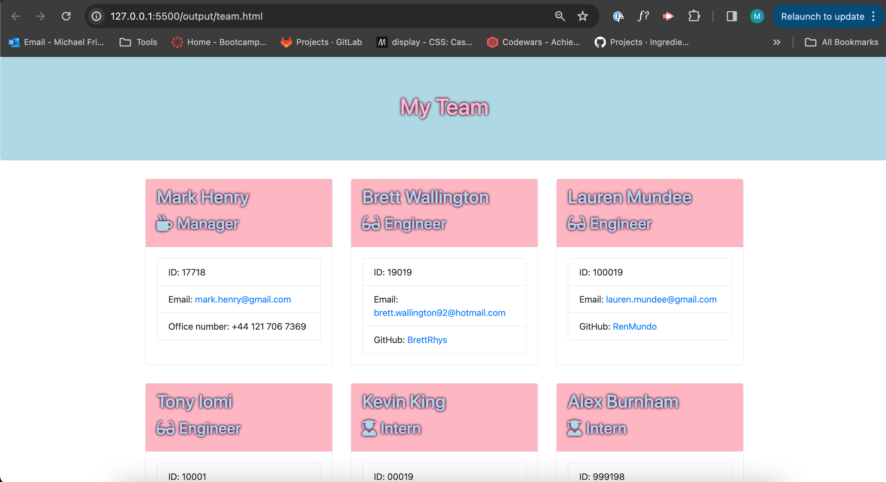
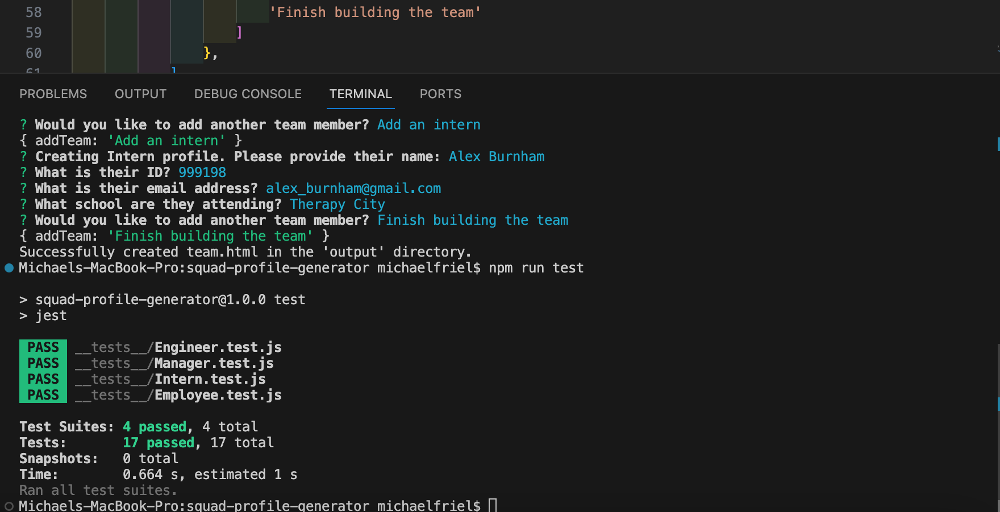

# Squad Profile Generator

## Description

This application is intended to be used as a dynamic Team Page Generator. A user can initialise the application and answer a variety of questions about their team. Once completed, a HTML page containing the team bipgraphies will be created. 

**This functionality is achieved by:**
* Classes for each employee type are configured.
* Inquirer is used to construct the set of questions and return and object for each employee.
* Team information stored and passed to the render function.
* Render function generates HTML once the questions are completed.

## Installation
In order to use this application, you will need to install Inquirer and Jest. You will also need to clone this repository in order to initialise the function on your local machine. Further details can be found within the [Git Hub repository](https://github.com/MichaelFriel/squad-profile-generator).

## Usage
This application uses the inquirer package to generate a series of questions; the answers to which form the basis of the HTML page. In order to initialise this, you will need to run **node index.js** in the appropriate directory.

 
*This image shows an example of the index page once the team has been inputted and html generated.*
   
 
*This image shows the successful tests within the terminal.*

## Tests
There are a number of tests available in order to ensure that this code remains functional and that no unanticipated bugs are introduced. These use the Jest package and can be initialised using the **npm run test** command.

## License
This application is covered under the Mit License

## Questions
If you have any questions, you can contact me in the following ways: 
[Git Hub Profile](https://github.com/MichaelFriel) (github.com/MichaelFriel) 
Email: mikefriel92@hotmail.com

